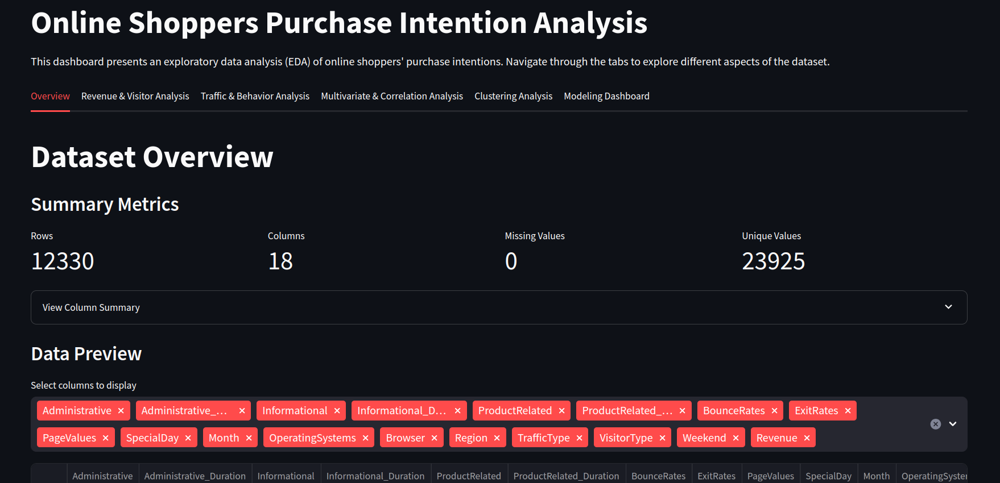
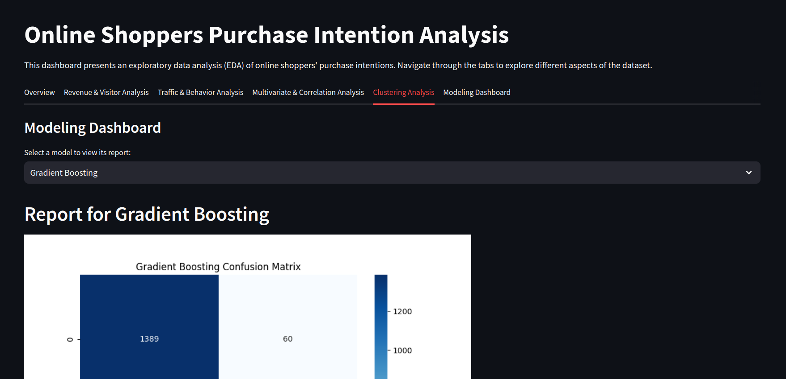

# Online Shoppers Intention Analysis

## Overview

This project analyzes online shopper behavior using various machine learning models. It includes an interactive Streamlit dashboard for exploratory data analysis (EDA) and model evaluation. The project evaluates multiple models and provides visual insights into the factors influencing shopper purchases. Here is the demo of Dashboard:
 <br>
<table>
  <tr>
    <td></td>
    <td></td>
  </tr>
</table>

## Features

- **Streamlit Dashboard**: Interactive interface for exploring data and visualizing model performance.
  - **Exploratory Data Analysis (EDA)**: Visualizations of key metrics, distributions, and relationships between variables.
  - **Clustering Analysis**: Interactive clustering results to find patterns in shopper behavior.
  - **Model Comparison**: ROC curves and performance metrics for comparing different machine learning models.

- **Model Comparison**: Evaluation of various classification models including:
  - Naive Bayes
  - K-Nearest Neighbors (KNN)
  - Support Vector Machine (SVM)
  - Random Forest
  - Gradient Boosting
  - AdaBoost

## Data

The dataset used is `online_shoppers_intention.csv`, which includes features related to shopper behavior and their purchase intentions.

## Installation

1. Clone the repository:

    ```bash
    git clone https://github.com/MahtabRanjbar/Onlineshopping_analysis_dashboard.git
    cd Onlineshopping_analysis_dashboard
    ```

2. Install the required packages:

    ```bash
    pip install -r requirements.txt
    ```

## Usage

### Running the Streamlit Dashboard

To start the interactive dashboard, run the following command:

```bash
streamlit run src/streamlit_app.py
```
This will launch the Streamlit server and open the dashboard in your browser. You can explore various tabs including EDA, clustering analysis, and model comparison.

### Model Training and Evaluation
To train and evaluate the models, execute:
```bash
python src/model_training.py
```
This script trains multiple classification models, evaluates their performance, and saves the results, including confusion matrix plots and ROC curves.

## File Structure
- **data/:** Contains the dataset.
- **reports/:** Includes model evaluation reports and comparison plots.
- - **model_reports/:** Contains confusion matrix plots for each model.
- - **comparison/:** Contains ROC curve plots and model comparison tables.
- **src/:** Source code for model training, evaluation, and the Streamlit app.
- -  **model_training.py:** Script for training and evaluating models.
- -  **utils.py:** Utility functions for model evaluation and reporting.
- -  **streamlit_app.py:** Streamlit application for data exploration and model comparison.
